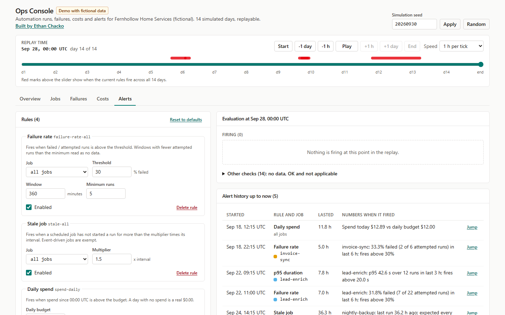

# Ops Console: automation runs, failures, costs and alerts

A replayable operations dashboard for a small company's scheduled automations: run health, grouped failures, daily spend against a budget, and an editable alert rule engine, driven by a seeded 14-day simulation.

**Live demo:** https://ops-console-sable.vercel.app (fictional data)



## What this demonstrates

- A deterministic, seeded simulator (`src/sim/`) that produces 14 days of runs for six jobs, with three injected incidents: a vendor rate-limit storm, a scheduler that silently stops, and an SMS cost spike. Same seed, same data, checked by test.
- An alert engine (`src/alerts/`) with four rule types (failure rate over a window, daily spend over budget, stale job, p95 duration) that reports the exact numbers behind every firing, and a replay that turns point-in-time checks into alert episodes with start, end and peak.
- Correctness choices written down and tested: an empty window is "no data", never "0 percent failure"; a job that has not run is measured from the start of observation, so a silent stop always alerts; p95 uses the nearest-rank method; retried-then-succeeded runs count as success but are reported separately; money is stored and summed in integer cents.
- A test for each injected incident proving the default rules fire it, repeated on five other seeds so detection does not depend on a lucky seed.
- A dense internal-tool UI in React and Tailwind: hand-written SVG charts, a time scrubber that replays the 14 days, a validated rules editor, light and dark themes, keyboard focus styles, status shown by shape and text as well as color, and a colorblind-safe (Okabe-Ito) job palette.

Live demo: https://ops-console-sable.vercel.app

## Run it

Requires Node 22.

```
npm install
npm run dev        # local dev server
npm test           # vitest, runs offline
npm run typecheck  # tsc --noEmit
npm run build      # static build in dist/
```

URL parameters make any moment linkable: `?seed=20260930&view=alerts&at=2026-09-22T13:00:00Z`. `view` is one of overview, jobs, failures, costs, alerts.

## How it works

```
 seed ──> sim/simulate.ts ──> Run[] (14 days, sorted, integer-cent costs)
                                │
                                ├──> alerts/runIndex.ts   sorted per-job arrays, binary-search windows
                                │         │
                                │         ├──> alerts/evaluate.ts   rules + time "now" -> Evaluation[]
                                │         └──> alerts/history.ts    evaluate every 15 min -> AlertEpisode[]
                                │
                                └──> metrics/  stats.ts (rates, windows, daily buckets)
                                               percentile.ts (nearest-rank p95)
                                               money.ts (integer cents), failures.ts, costs.ts
                                                     │
 App.tsx: seed, rules, replay time "now" ──> ui/views/ Overview, Jobs, Failures, Costs, Alerts
```

- `src/sim/jobs.ts`: the six jobs, their schedules, expected intervals and colors.
- `src/sim/simulate.ts`: run generation, failure and retry profiles, and the `INCIDENTS` constant (rate-limit storm on day 9, 09:00 to 14:00 UTC; nightly-backup silent on days 11 and 12; SMS cost spike on day 5, 10:00 to 16:00 UTC).
- `src/alerts/rules.ts`: rule types and `DEFAULT_RULES`.
- The replay never shows the future: a run is visible only once it has finished (`startedAt + durationMs <= now`).

Default rules:

| Rule | Setting |
| --- | --- |
| failure-rate-all | any job, failure rate above 30 percent over 6 h, at least 5 attempted runs |
| stale-all | any scheduled job with no run for more than 1.5 times its expected interval |
| spend-daily | spend since 00:00 UTC above $12.00 |
| p95-lead-enrich | lead-enrich p95 duration above 20 s over 3 h |

On the default seed (20260930) the replay produces these alert episodes:

| Started (UTC) | Rule | Job | Cause |
| --- | --- | --- | --- |
| Sep 18 12:15 | spend-daily | all | SMS cost spike (injected) |
| Sep 18 22:15 | failure-rate-all | invoice-sync | 2 of 6 runs failed in 6 h (ordinary noise, not injected) |
| Sep 22 09:15 | p95-lead-enrich | lead-enrich | rate-limit storm (injected) |
| Sep 22 11:00 | failure-rate-all | lead-enrich | rate-limit storm (injected) |
| Sep 24 14:15 | stale-all | nightly-backup | silent stop (injected), resolves Sep 26 02:30 |

## Tests

`npm test` runs 73 tests in 8 files with Vitest, in Node, offline.

- `sim/simulate.test.ts`: seed determinism, seed sensitivity, data invariants (unique ids, sort order, integer cents, attempts consistent with status, logs present on errors), each injected incident present in the raw data.
- `metrics/percentile.test.ts`: nearest-rank p95 on empty, 1, 10, 20 and 100 values, unsorted input, no interpolation, invalid percentiles.
- `metrics/money.test.ts`: rounding at the edge, exact sums where floats drift, rejection of non-integer cents, formatting.
- `metrics/stats.test.ts`, `metrics/aggregates.test.ts`: no data versus 0 percent, skipped runs, retried-success handling, half-open windows, unfinished runs hidden, daily buckets, failure grouping, daily costs.
- `alerts/evaluate.test.ts`: every rule type above, at and below threshold, empty windows, minimum sample size, never-run jobs, event-driven jobs, day boundaries for spend, binary-search windows matching a plain filter.
- `alerts/incidents.test.ts`: one test per injected incident proving the default rules fire it, no false stale alerts, detection on seeds 1 to 5, episode merging and clipping.
- `App.test.tsx`: server-side render of the app and every view mid-incident and at the empty start.

## Limitations and honest notes

- The data is simulated. Failure rates, durations and prices are plausible guesses, not measurements from a real system.
- Alert history is evaluated on a 15-minute grid, so a condition shorter than one step can be missed, and start times are rounded up to the next step.
- The default 6-hour failure-rate window trades speed for stability: it fires about two hours into the day 9 storm, while the p95 rule catches it within 15 minutes. It also fires once on ordinary noise (invoice-sync, day 5). Both are left visible on purpose rather than tuned away.
- Stale detection uses the start of the last finished run. A run that is still in progress does not count as proof of life until it finishes.
- The rules editor keeps state in memory only; a reload resets rules to the defaults. The seed, view and replay time do persist in the URL.
- There are no browser interaction tests; UI coverage is a server-side render smoke test. The logic the UI shows is covered by unit tests.
- All times are UTC.

## Data notice

All data is fictional. "Fernhollow Home Services", its jobs, vendors, invoice numbers, record ids, phone numbers (555-01xx, a range reserved for fiction) and log lines are generated by the simulator. No real company, person or customer data is used, and no public dataset is included.

MIT License, copyright Ethan Chacko.
